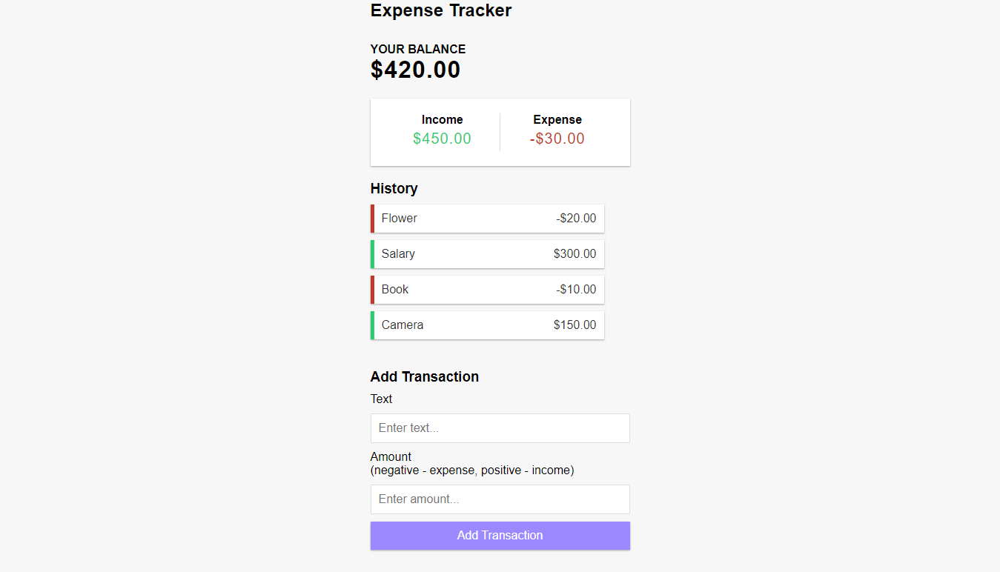

<h1 align="center"> Expense Tracker </h1>
<p align="center">
  <a href="https://opensource.org/licenses/MIT">
    
  </a>
</p>

<p align="center">
   
</p>


<p align="center">Simple application to add expenses and income for the month.</p>

# :pushpin: Table of Contents

* [Features](#rocket-features)
* [Installation](#construction_worker-installation)
* [FAQ](#postbox-faq)

# :rocket: Features
* Add Transaction.
* Remove Transaction.
* Calculate total income.
* Calculate total expenses.
* Display your balance.

# :construction_worker: Installation

**You need to install [Node.js](https://nodejs.org/en/download/) and [Yarn](https://yarnpkg.com/) first, then in order to clone the project via HTTPS, run this command:**

```
git clone https://github.com/lzhudson/expense-tracker-with-react.git
```

**Install dependencies**

```
yarn
```

**Start development server**

```
yarn start
```

# :postbox: Faq

**Question** What were used to build the application?

**Answer:**

- [React](https://pt-br.reactjs.org/)
- [Styled Components](https://styled-components.com)

Made with love by [Hudson Holanda](https://github.com/lzhudson) 💜🚀
